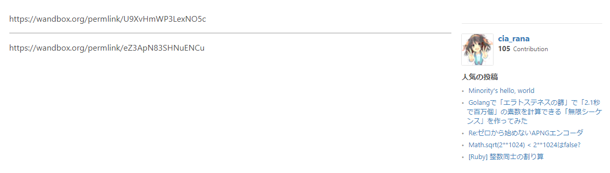
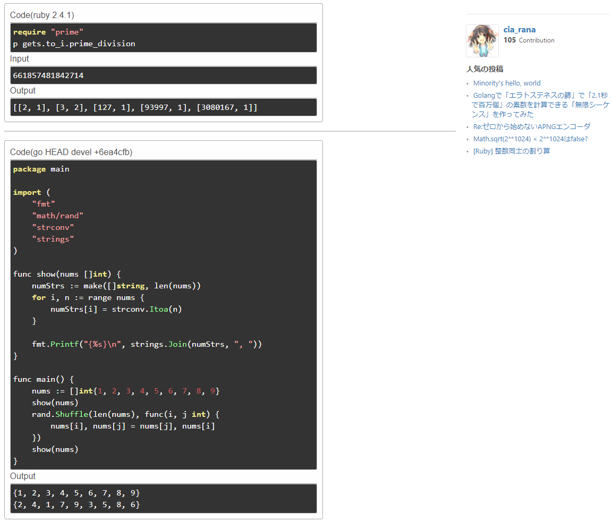

# Wandbox Result Viewer
*Wandbox Result Viewer* is a Chrome Extension to convert a permanent link of [Wandbox](https://wandbox.org/) to a source code(and standard I/O) frame. This uses [Wandbox API](https://github.com/melpon/wandbox/blob/master/kennel2/API.rst#get-permlinklink).

## Usage
1. Enable this on [Chrome Extensions](chrome://extensions).
1. Write source code and run it on [Wandbox](https://wandbox.org/).
1. Copy a permanent link as a shered URL. Suppose it is `https://wandbox.org/permlink/xxx`.
1. Inject tags `
https://wandbox.org/permlink/xxx
` into pages where you want to show source code(and standard I/O).
1. Good luck! 😊

## Example
- **Before**

- **After**
